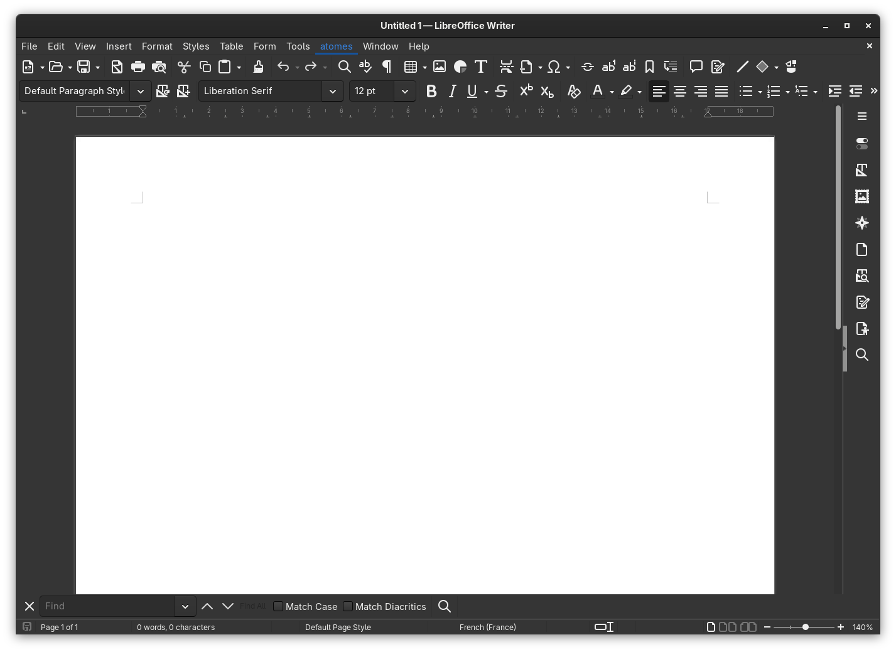
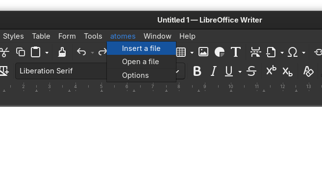
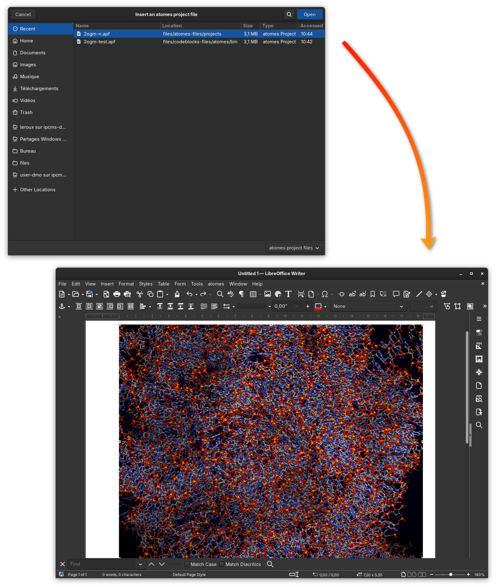
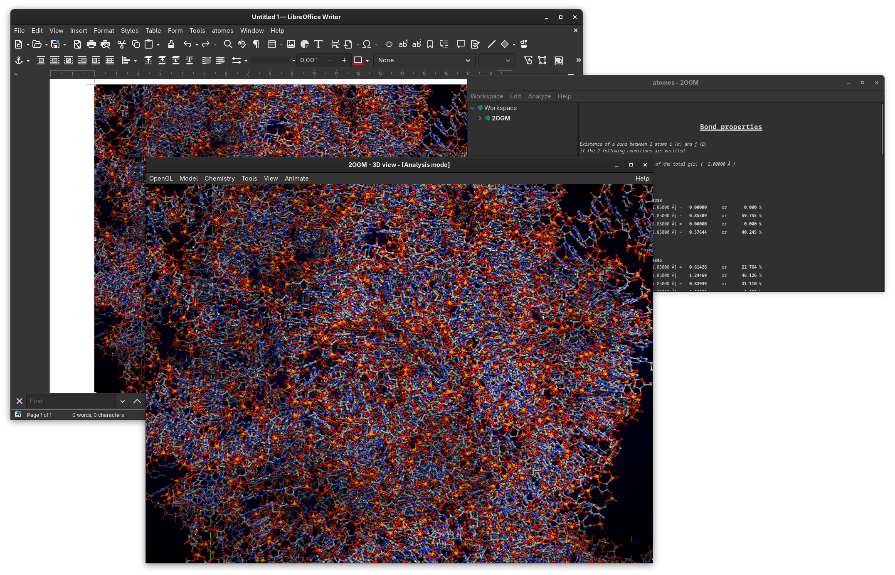
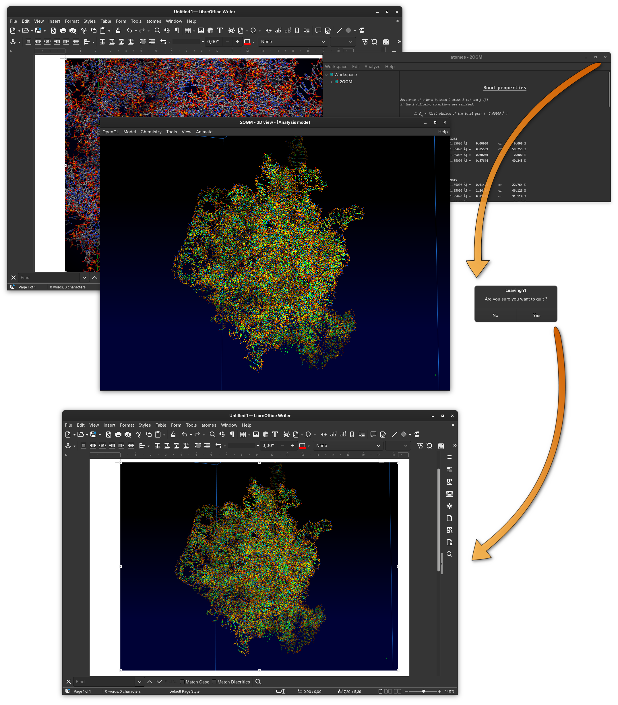
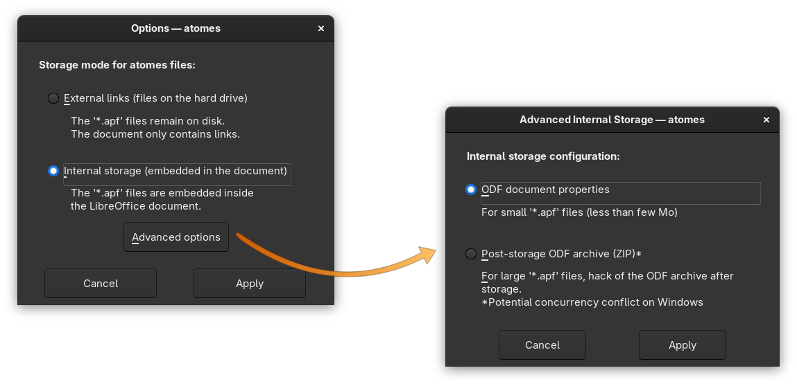

# atomes extension for [LibreOffice][libreoffice]

![License][license]
![Development Status][dev_status]

Extension to insert [atomes][atomes] projet file(s) in any [LibreOffice][libreoffice] document. 

## Install instructions

Download the file [atomes_extension.oxt][atomes_extension] that contains the extension.

### Using [LibreOffice][libreoffice]

Open [LibreOffice][libreoffice], press `Ctrl+Alt+E` (to open the extension manager), then browse to select the file `atomes_extension.oxt` and install. 

### Using the terminal

```[bash]
unopkg add atomes_extension.oxt
```

## Remove instructions

### Using the terminal

```[bash]
unopkg remove atomes_extension.oxt
```
 
## Build instructions

To build (package) the extension: 

```
./build.sh
```

## Dependency for Linux

On Linux Python scripts support is not included in the base installation of [LibreOffice][libreoffice], 
therefore you need to install it: 

### Debian based Linux:

```[bash]
sudo apt install libreoffice-script-provider-python
```

### RedHat based Linux:

```[bash]
sudo dnf install libreoffice-pyuno
```

## How does this extension work

Open any LibreOffice tool (Writer, Calc ...) once the extension is installed you will see an **atomes** sub-menu inserted in the top level menu bar: 

<p align="center">

</p>

The extension allows:
  - to insert **atomes** project files into any LibreOffice document
  - open any **atomes** project that was inserted in the LibreOffice document
  - tweak the extension options

### Inserting an **atomes** project in a LibreOffice document

<p align="center">

</p>

Once inserted in the LibreOffice document the **atomes** project is represented by an image that illustrates the content of the project file. This image is generated by **atomes** and precisely represents the latest snapshot of the project. 

<p align="center">

</p>

You can move around, resize, reshape this image as any LibreOffice image. The **atomes** project is now embedded in the LibreOffice document, 
not that depending on your options the insertion might be done by direct embedding (a copy of the **atomes** project is inserted in the LibreOffice document zip archive), 
or via a symbolic link to the orginal **atomes** project file. Note that is possible to swith between embedding modes at any time using the extension options (see below). 

### Editing an **atomes** project embedded in a LibreOffice document

Use the extension menu and select *Open a file*, if only one **atomes** project file happens to be embedded in the document this file 
will be opened immediately otherwise you will be ask to select the projet to open. Alternatively simply double click on the image corresponding to the project
you want to open, that does the trick:

<p align="center">

</p>

Althought some restrictions are applied to this embedded version of **atomes**, for instance it is possible to create/open other project, 
you can work with this interface as with the standard one, perform calculation, change the visual aspect ... 

> [!IMPORTANT]
> The work done on the project file uisng this embedded vesion of **atomes** will be automatically saved after closing, and the image inserted in the LibreOffice document will be updated accordingly.
> The project file be modified meaning that if the embedded is done via symbolic link then the original file will be modified ! 

<p align="center">

</p>

### Accessing the extension options

In the extension menu select the *options* item, the options dialog offers to swith between internal and external storage for the **atomes** project files. 
It it also possible to configure the mode of internal storage. 
Please note that on pressing apply the storage mode of the **atomes** project(s) that could be inserted in your LibreOffice document will be changed, 
and if required internal document(s) extraced on the hard drive or vice versa. 

<p align="center">

</p>


## Who's behind ***atomes*** (and this extension)


***atomes*** is developed by [Dr. Sébastien Le Roux][slr], research engineer for the [CNRS][cnrs]

<p align="center">
  <a href="https://www.cnrs.fr/"></a>
</p>

[Dr. Sébastien Le Roux][slr] works at the Institut de Physique et Chimie des Matériaux de Strasbourg [IPCMS][ipcms]

<p align="center">
  <a href="https://www.ipcms.fr/"></a>
</p>

[atomes_extension]:https://github.com/Slookeur/atomes-libreoffice/tree/main/atomes_extensio.oxt
[libreoffice]:https://www.libreoffice.org/
[license]:https://img.shields.io/badge/License-AGPL_v3%2B-blue
[dev_status]:https://www.repostatus.org/badges/latest/active.svg
[slr]:https://www.ipcms.fr/sebastien-le-roux/
[cnrs]:https://www.cnrs.fr/
[ipcms]:https://www.ipcms.fr/
[github]:https://github.com/
[jekyll]:https://jekyllrb.com/
[atomes]:https://atomes.ipcms.fr/
[atomes-doc]:https://slookeur.github.io/atomes-doc/
[atomes-tuto]:https://slookeur.github.io/atomes-tuto/
[dlpoly]:https://www.scd.stfc.ac.uk/Pages/DL_POLY.aspx
[lammps]:https://lammps.sandia.gov/
[cpmd]:http://www.cpmd.org
[cp2k]:http://cp2k.berlios.de
[gtk]:https://www.gtk.org/
[openmp]:https://www.openmp.org/
